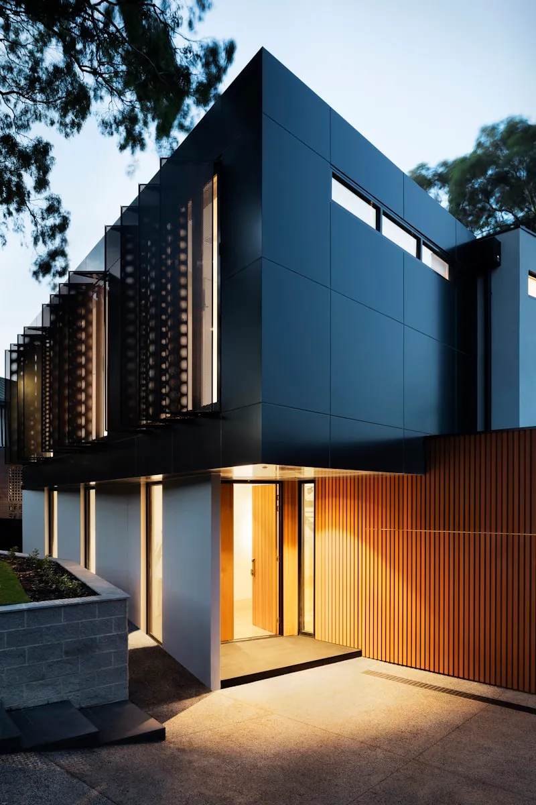

# SOP & PANDUAN PENAMBAHAN BLOG ARTIKEL BARU
**ARSITEK MALANG (`https://arsitekmalang.web.id`)**

Dokumen ini adalah standar operasional prosedur (SOP) dan instruksi otomatis untuk pembuatan dan penambahan artikel blog baru pada website **Arsitek Malang**. Setiap kali Anda (atau asisten AI) ingin menambahkan artikel baru, **cukup ikuti seluruh aturan, checklist, dan template di dalam dokumen ini tanpa perlu mengetikkan ulang instruksi panjang lebar**.

---

## ⚡ CARA CEPAT PENGGUNAAN (QUICK TRIGGER)

Cukup berikan perintah singkat di chat seperti berikut:

```text
Tolong tambahkan artikel blog baru sesuai dengan SOP di PANDUAN_TAMBAH_ARTIKEL.md dengan:
- Judul / Topik : [Contoh: Panduan Desain Villa Modern Kontemporer di Lahan Miring Batu Malang]
- Kategori      : [Contoh: Jasa Arsitek / Desain Rumah / Tips Renovasi / Legalitas PBG / Konstruksi / Desain Interior]
- Kata Kunci    : [Contoh: desain villa batu malang, arsitek villa lahan miring, konstruksi villa kontur]
- Gambar Utama  : [Opsional: Jika tidak diisi, Gemini/AI wajib men-generate gambar baru yang sesuai isi artikel]
```
*(Jika salah satu data di atas tidak diisi oleh pengguna, asisten AI/Gemini wajib menentukan konten terbaik serta men-generate gambar fotorealistik berkualitas tinggi yang 100% relevan dengan isi dan topik artikel).*

---

## 📋 DAFTAR CHECKLIST WAJIB (WORKFLOW LENGKAP)

Setiap penambahan artikel baru **WAJIB** mengeksekusi 6 langkah berikut secara tuntas:

1. **Men-generate Gambar yang Sesuai Isi Artikel Menggunakan Gemini (`generate_image` / AI Image Generation)**:
   - Buat **Gambar Utama (Featured Image)**: `assets/img/[slug-artikel]-01.webp` (Landscape 16:9) yang merepresentasikan konsep utama artikel secara visual dan fotorealistik arsitektur.
   - Buat **Gambar Ilustrasi Pendukung (Body Image)**: `assets/img/[slug-artikel]-02.webp` (Landscape 16:9 atau 4:3) yang memperjelas detail teknis/interior/fasad/konstruksi yang dibahas pada artikel.
   - Simpan gambar ke direktori `assets/img/` dengan penamaan SEO-friendly berbasis slug artikel.
2. **Membuat File HTML Artikel Baru (`[slug-artikel].html`)** di root project sesuai anatomi dan template master, dengan menyematkan gambar-gambar yang telah dibuat.
3. **Menyesuaikan Tanggal Secara Otomatis** dengan tanggal hari saat pembuatan artikel (misal tanggal saat ini `31 Agustus 2026`).
4. **Mendaftarkan Artikel Baru ke Halaman [blog.html](file:///d:/Magang%20Industri/arsitekmalangweb/arsitekmalang/blog.html)**:
   - Tambahkan kartu artikel baru pada urutan teratas dalam container `<div class="row g-4">` menggunakan thumbnail `[slug-artikel]-01.webp`.
   - Update featured card (jika artikel tersebut dijadikan artikel sorotan terbaru).
5. **Mendaftarkan URL Baru ke [sitemap.xml](file:///d:/Magang%20Industri/arsitekmalangweb/arsitekmalang/sitemap.xml)** beserta update tag `<lastmod>` untuk URL baru dan URL `blog.html`.
6. **Menjaga Internal Linking (Cross-linking & Topic Silo)**:
   - Mengarahkan tautan ke *Money Pages* layanan utama (`jasa-arsitek.html`, `kontraktor-rumah.html`, `kontraktor-bangunan.html`, `renovasi-bangunan.html`, `desain-interior.html`).
   - Menyisipkan tautan silang ke artikel relevan lainnya pada blok *Baca Juga* dan *Rekomendasi Paket Layanan*.

---

## 🖼️ STANDAR GENERASI & OPTIMASI GAMBAR DENGAN GEMINI

Setiap artikel blog di website **Arsitek Malang** wajib memiliki visual arsitektur yang estetik, fotorealistik, dan memiliki *WOW factor* tinggi. Visual yang kuat meningkatkan *dwell time* pengunjung, kredibilitas brand, dan performa SEO artikel.

### 1. Jumlah dan Peran Gambar Wajib (Minimal 2 Gambar per Artikel)
| Tipe Gambar | Penamaan File | Aspek Rasio | Penempatan di Website | Konten Visual yang Ditampilkan |
| :--- | :--- | :--- | :--- | :--- |
| **Gambar Utama (Featured Image)** | `assets/img/[slug]-01.webp` | `16:9` (Landscape) | • Header artikel (`article-image-wrap`)<br>• Open Graph (`og:image`) & Twitter Card<br>• Structured Data `BlogPosting`<br>• Thumbnail Card di `blog.html` | Tampilan fasad bangunan utama, eksterior arsitektur tropis/modern, atau keseluruhan konsep desain yang menjadi topik inti artikel. |
| **Gambar Pendukung (Body Image)** | `assets/img/[slug]-02.webp` | `16:9` atau `4:3` | • Bagian tengah artikel (setelah H3 Subjudul 1) | Detail spesifik artikel: interior ruangan, sistem retaining wall/pondasi, material finishing, bukaan sirkulasi udara, atau suasana detail arsitektural. |

### 2. Format Prompt Gemini untuk Generasi Gambar (`generate_image`)
Gunakan formula prompt arsitektur profesional berikut saat men-generate gambar dengan Gemini:

```text
[Subjek Bangunan/Ruang] + [Gaya Arsitektur & Material] + [Konteks Lingkungan & Cuaca] + [Pencahayaan & Suasana] + [Sudut Pengambilan Kamera] + [Kualitas Visual]
```

#### 📌 Contoh Template Prompt Sesuai Topik Artikel:
- **Artikel Desain Villa Lahan Miring / Kontur (Batu/Malang):**
  > *"Architectural photography of a luxury modern tropical villa built on a steep slope in Batu Malang East Java. Multi-level split structure, cantilevered concrete decks, expansive glass walls, natural volcanic stone and warm teak wood elements, infinity plunge pool overlooking misty mountain valley, lush tropical pines, soft golden hour sunlight, ultra realistic, 8k resolution, architectural digest style, no people, wide angle."*
- **Artikel Konstruksi / Retaining Wall / Pondasi:**
  > *"Close-up architectural photograph of a high-end reinforced concrete and natural river stone retaining wall on a terraced slope residential project in Malang. Proper drainage weep holes visible, clean modern architectural detailing, lush green landscaping at the perimeter, overcast bright daylight, professional construction photography, realistic textures."*
- **Artikel Desain Rumah Tropis Modern Minimalis:**
  > *"Exterior architectural photography of an elegant 2-story modern tropical house in Lowokwaru Malang. Wide roof eaves for rain protection, large black aluminium sliding glass doors, wooden louvers for cross ventilation, private inner courtyard garden with tropical plants, bright warm morning lighting, clean minimalist aesthetics, photorealistic 8k."*
- **Artikel Desain Interior (Dapur / Ruang Tamu / Master Bedroom):**
  > *"Interior design photography of a luxury clean minimalist open-plan living room and kitchen in Malang residence. Seamless marble island, warm wood cabinetry, hidden warm LED strip lighting, large floor-to-ceiling windows showing green garden, Japandi and modern tropical fusion, photorealistic, pristine architectural magazine quality."*
- **Artikel Legalitas PBG / SIMBG / Kantor Konsultan Arsitek:**
  > *"Architectural firm studio workspace in Malang. Wooden drafting tables with rolled blueprints, architectural 3D scale models of modern tropical houses, laptop with CAD drawings, stylish minimalist interior with exposed brick and indoor plants, soft natural daylight pouring in, professional architectural office vibe."*

### 3. Ketentuan Teknis dan SEO Gambar
1. **Bebas Watermark & Teks**: Pastikan gambar bersih tanpa ada teks buatan, logo acak, atau bingkai perangkat (kecuali jika diminta khusus).
2. **Format & Kompresi**: Simpan dalam format `.webp` (direkomendasikan) atau `.jpg`/`.png` terkompresi dengan baik untuk menjaga kecepatan loading halaman (Google PageSpeed score tinggi).
3. **Penamaan File Relevan**: Gunakan slug artikel yang kaya kata kunci (Contoh: `desain-rumah-split-level-lowokwaru-01.webp`, `biaya-renovasi-rumah-2-lantai-malang-02.webp`).
4. **Optimasi Alt-Text (`alt=""`)**: 
   - Gambar 1: `alt="[Judul Lengkap Artikel] – Konsep Desain Arsitek Malang"`
   - Gambar 2: `alt="Detail [Topik Teknis/Interior/Konstruksi] Proyek Arsitek Malang"`

---

## 📅 ATURAN PENANGGALAN OTOMATIS (DATE SYSTEM)

Tanggal artikel **wajib disesuaikan dengan tanggal hari saat artikel dibuat**:
- **Format Tampilan Meta Bar Artikel**: `DD MMMM YYYY` (Contoh: `31 Agustus 2026`)
- **Format Tampilan Card & Sidebar**: `DD Bln YYYY` (Contoh: `31 Agt 2026`)
- **Format JSON-LD (`datePublished` & `dateModified`)**: `YYYY-MM-DD` (Contoh: `2026-08-31`)
- **Format Sitemap (`<lastmod>`)**: `YYYY-MM-DD` (Contoh: `2026-08-31`)

---

## 🏛️ PILAR KONTEN & PEMETAAN KATEGORI (CONTENT SILO)

Setiap artikel harus diklasifikasikan ke dalam salah satu kategori layanan utama Arsitek Malang:

| Kategori | Target Layanan / Money Page | Contoh Topik & Keyword |
| :--- | :--- | :--- |
| **Jasa Arsitek & Desain Rumah** | `jasa-arsitek.html` | Desain Rumah Split Level, Villa Lahan Miring, Fasad Minimalis Tropis, Rumah 2 Lantai. |
| **Kontraktor & Konstruksi** | `kontraktor-rumah.html` / `kontraktor-bangunan.html` | Retaining Wall Lahan Berkontur, Pondasi Tahan Gempa, Struktur Beton Bertulang, Mutu Material. |
| **Renovasi & Pemugaran** | `renovasi-bangunan.html` | Estimasi Biaya Renovasi 2 Lantai, Renovasi Rumah Kolonial Ijen, Tips Renovasi Hemat. |
| **Legalitas PBG / SIMBG** | `tahapan-mengurus-imb-pbg-malang.html` | Panduan SIMBG Pemkot/Pemkab Malang, Sanksi Tanpa PBG, Syarat Sertifikat IAI. |
| **Estimasi Biaya & RAB** | `cara-menyusun-rab-jasa-arsitek-malang.html` | Cara Hitung RAB Rumah Type 36/45, Komparasi Semen & Bata Jatim, Biaya Bangun per M². |
| **Desain Interior** | `desain-interior.html` | Tata Ruang Open-Plan, Interior Dapur Clean Minimalis, Kamar Tidur Mewah, Pencahayaan Alami. |

---

## 📐 ANATOMI LAYOUT ARTIKEL (WAJIB LENGKAP)

File artikel baru harus memiliki struktur layout persis seperti standar artikel acuan (`desain-rumah-split-level-lowokwaru-malang.html` & `panduan-mengurus-pbg-malang-simbg.html`), yang terdiri dari:

### 1. Header & Head Tags SEO
- `<title>`: `[Judul Artikel Menarik & Berbobot] – Arsitek Malang`
- `<meta name="description">`: Ringkasan 140–160 karakter memuat keyword utama, solusi arsitektur, dan wilayah Malang/Batu/Jatim.
- `<meta name="keywords">`: 5–8 keyword relevan (contoh: `arsitek malang, jasa arsitek malang, renovasi rumah malang, PBG Malang`).
- `<link rel="canonical" href="https://arsitekmalang.web.id/[slug-artikel].html">`
- Tag Favicon (SVG data-uri / `favicon.svg`, `favicon-48x48.png`, `apple-touch-icon.png`, `site.webmanifest`).
- Open Graph Tags (`og:type="article"`, `og:title`, `og:description`, `og:url`, `og:image`, `og:site_name="Arsitek Malang"`, `og:locale="id_ID"`).
- Twitter Card (`summary_large_image`).
- GEO Meta Tags: `geo.region="ID-JI"`, `geo.placename="Lowokwaru, Malang"`, `geo.position="-7.9467;112.6159"`, `ICBM="-7.9467, 112.6159"`.
- JSON-LD Structured Data: `BlogPosting` dan `BreadcrumbList`.
- CSS: Google Fonts (Roboto & Poppins), Bootstrap 5.3.2 CSS, Bootstrap Icons 1.11.3, AOS 2.3.4 CSS, dan `css/style.css`.

### 2. Header & Sticky Navbar
- Logo Brand: `<a href="index.html" class="logo"><i class="bi bi-buildings-fill text-primary-custom me-2"></i>Arsitek Malang</a>`
- Navmenu: Beranda, Tentang Kami, Dropdown Layanan (Jasa Arsitek, Kontraktor Rumah, Kontraktor Bangunan, Renovasi Bangunan, Desain Interior), Galeri, Blog (status `active`).
- Mobile Nav Toggle: `<button class="mobile-nav-toggle bi bi-list" id="mobileNavToggle"></button>`.

### 3. Page Hero Section (`<section class="page-hero">`)
- `<h1>`: Judul Lengkap Artikel.
- `<p>`: Subjudul atau Ringkasan Singkat Nilai Tambah.
- Breadcrumb Nav: `Beranda` > `Blog` > `[Judul Singkat Artikel]`.

### 4. Konten Utama Artikel (`<main>` -> `col-lg-8`)
1. **Meta Bar**: Tanggal hari ini (`DD MMMM YYYY`), Penulis `Muhammad Musyaffa`, Status Peninjau: `<i class="bi bi-patch-check me-1"></i>Ditinjau oleh Arsitek Berlisensi IAI Malang`.
2. **Main Title Heading (`<h1>`)**: `fw-800 mb-4` dengan gaya tipografi tegas.
3. **Featured Image Wrap**: Kartu gambar utama dengan sudut melengkung `rounded-4 shadow-sm` dan alt-text kaya kata kunci.
4. **Summary Box (Ringkasan Inti)**: Box p-4 rounded-3 latar `#f8fafc` dengan border kiri `border-left: 4px solid var(--accent-color);`, memuat icon `<i class="bi bi-bookmark-check-fill text-primary-custom me-2"></i>Ringkasan Inti` dan 4–5 butir poin ringkasan utama.
5. **Table of Contents (Daftar Isi Artikel)**: Box border putih rapi dengan daftar terurut (`<ol>`) anchor links `#sec-1`, `#sec-2`, `#sec-3`, `#sec-4` (tanpa tautan kesimpulan).
6. **Lead Paragraph**: Paragraf pembuka berbobot dengan gaya lead `fs-5 fw-500`.
7. **Isi Artikel (Minimal 3–4 Subjudul H3 + FAQ)**:
   - `<h3 id="sec-1">`: Pembahasan fondasi teori / masalah lapangan di Malang.
   - Gambar teknis / ilustrasi tambahan (`article-image-wrap`).
   - `<h3 id="sec-2">`: Solusi desain arsitektural & teknik eksekusi.
   - **Pro Tip Box (Catatan Arsitek Malang)**: Kotak biru muda bergaris tepi aksen memuat tips praktis dari arsitek.
   - **Inline Callout "Baca Juga"**: Box tautan silang ke 2 artikel blog relevan lainnya.
   - `<h3 id="sec-3">`: Aspek legalitas (PBG/SIMBG), struktur bangunan, atau efisiensi anggaran.
   - `<h3 id="sec-4">`: **FAQ (Pertanyaan Sering Diajukan)**: 3 pertanyaan dan jawaban teknis paling sering diajukan klien.
   - ⚠️ **ATURAN WAJIB: TIDAK PERLU KESIMPULAN**: **Dilarang keras / TIDAK PERLU menambahkan subjudul "Kesimpulan" atau "Kesimpulan Praktis"** di bagian akhir artikel maupun di dalam Daftar Isi (TOC). Artikel langsung ditutup setelah bagian FAQ, lalu langsung tersambung ke CTA Box.
8. **CTA Box Interaktif**: Gradien halus aksen dengan headline konsultasi dan tombol WhatsApp langsung memanggil fungsi `openWA('Konsultasi [Topik Artikel]')`.
9. **Author Bio Card**: Kartu profil Muhammad Musyaffa (Tim Riset Arsitektur Maroon Arsitek Malang / Spesialis Legalitas PBG & Konstruksi).
10. **Rekomendasi Paket Layanan Sesuai Bacaan**: 2 kartu layanan terkait (misal: *Paket Jasa Arsitek 3D Komplit* & *Paket Kontraktor Bangun Rumah*) lengkap dengan tombol detail paket dan tombol konsultasi WA.

### 5. Sidebar Kolom Kanan (`col-lg-4`)
- **Widget Artikel Terbaru / Terkait**: List 3 artikel relevan dengan thumbnail WebP, judul ringkas, dan tanggal publikasi.
- **WA CTA Card**: Banner bantuan konsultasi langsung dengan tombol `openWA()`.

### 6. Footer & Navigasi Global
- Footer standar 4 kolom Arsitek Malang lengkap dengan kontak, tautan layanan, info navigasi, dan hak cipta.
- Floating WA Button: `<a href="javascript:void(0)" onclick="openWA()" class="wa-float"><i class="bi bi-whatsapp"></i></a>`.
- Scroll to Top Button: `<button id="scroll-top"><i class="bi bi-arrow-up-short"></i></button>`.
- Scripts: Bootstrap 5.3.2 JS, AOS 2.3.4 JS, dan `js/main.js`.

---

## 💻 TEMPLATE KODE MASTER ARTIKEL (`template-artikel.html`)

Gunakan template HTML di bawah ini sebagai pondasi pembuatan file artikel baru:

```html
<!DOCTYPE html>
<html lang="id">
<head>
  <meta charset="utf-8">
  <meta name="viewport" content="width=device-width, initial-scale=1.0">
  <title>{{JUDUL_SEO}} – Arsitek Malang</title>
  <meta name="description" content="{{META_DESCRIPTION}}">
  <meta name="keywords" content="{{META_KEYWORDS}}">
  <meta name="author" content="Arsitek Malang">
  <meta name="robots" content="index, follow, max-snippet:-1, max-image-preview:large, max-video-preview:-1">
  <link rel="canonical" href="https://arsitekmalang.web.id/{{SLUG_FILE}}.html">

  <!-- GEO Meta Tags -->
  <meta name="geo.region" content="ID-JI">
  <meta name="geo.placename" content="Lowokwaru, Malang">
  <meta name="geo.position" content="-7.9467;112.6159">
  <meta name="ICBM" content="-7.9467, 112.6159">

  <!-- OpenGraph SEO Tags -->
  <meta property="og:locale" content="id_ID">
  <meta property="og:type" content="article">
  <meta property="og:title" content="{{JUDUL_SEO}} – Arsitek Malang">
  <meta property="og:description" content="{{META_DESCRIPTION}}">
  <meta property="og:url" content="https://arsitekmalang.web.id/{{SLUG_FILE}}.html">
  <meta property="og:image" content="https://arsitekmalang.web.id/{{PATH_GAMBAR_UTAMA}}">
  <meta property="og:site_name" content="Arsitek Malang">

  <!-- Twitter Card -->
  <meta name="twitter:card" content="summary_large_image">
  <meta name="twitter:title" content="{{JUDUL_SEO}} – Arsitek Malang">
  <meta name="twitter:description" content="{{META_DESCRIPTION}}">
  <meta name="twitter:image" content="https://arsitekmalang.web.id/{{PATH_GAMBAR_UTAMA}}">

  <!-- ===== JSON-LD STRUCTURED DATA ===== -->
  <script type="application/ld+json">
  {
    "@context": "https://schema.org",
    "@graph": [
      {
        "@type": "BlogPosting",
        "@id": "https://arsitekmalang.web.id/{{SLUG_FILE}}.html#article",
        "headline": "{{JUDUL_UTAMA}}",
        "description": "{{META_DESCRIPTION}}",
        "url": "https://arsitekmalang.web.id/{{SLUG_FILE}}.html",
        "datePublished": "{{TANGGAL_YYYY_MM_DD}}",
        "dateModified": "{{TANGGAL_YYYY_MM_DD}}",
        "author": {
          "@type": "Person",
          "name": "Muhammad Musyaffa"
        },
        "publisher": {
          "@type": "Organization",
          "name": "Arsitek Malang",
          "url": "https://arsitekmalang.web.id"
        }
      },
      {
        "@type": "BreadcrumbList",
        "@id": "https://arsitekmalang.web.id/{{SLUG_FILE}}.html#breadcrumb",
        "itemListElement": [
          {
            "@type": "ListItem",
            "position": 1,
            "name": "Beranda",
            "item": "https://arsitekmalang.web.id/"
          },
          {
            "@type": "ListItem",
            "position": 2,
            "name": "Blog",
            "item": "https://arsitekmalang.web.id/blog.html"
          },
          {
            "@type": "ListItem",
            "position": 3,
            "name": "{{JUDUL_SINGKAT}}",
            "item": "https://arsitekmalang.web.id/{{SLUG_FILE}}.html"
          }
        ]
      }
    ]
  }
  </script>

  <!-- Favicon -->
  <link rel="icon" type="image/svg+xml" href="data:image/svg+xml,<svg xmlns='http://www.w3.org/2000/svg' viewBox='0 0 16 16' fill='%23007491'><path d='M14.763.075A.5.5 0 0 0 14.5 0H1.5a.5.5 0 0 0-.5.5v15a.5.5 0 0 0 .5.5h13a.5.5 0 0 0 .5-.5V.5a.5.5 0 0 0-.237-.425zM2 1h12v14H2V1zm2 2h2v2H4V3zm4 0h2v2H8V3zm-4 4h2v2H4V7zm4 0h2v2H8V7zm-4 4h2v2H4v-2zm4 0h2v2H8v-2z'/></svg>">

  <!-- Resource Preconnect -->
  <link rel="preconnect" href="https://fonts.googleapis.com">
  <link rel="preconnect" href="https://fonts.gstatic.com" crossorigin>
  <link rel="preconnect" href="https://cdn.jsdelivr.net" crossorigin>

  <!-- FONTS -->
  <link href="https://fonts.googleapis.com/css2?family=Roboto:wght@300;400;500;700;900&family=Poppins:wght@300;400;500;600;700;800;900&display=swap" rel="stylesheet" media="print" onload="this.media='all'">
  <noscript><link rel="stylesheet" href="https://fonts.googleapis.com/css2?family=Roboto:wght@300;400;500;700;900&family=Poppins:wght@300;400;500;600;700;800;900&display=swap"></noscript>

  <!-- CSS STYLES -->
  <link rel="preload" href="https://cdn.jsdelivr.net/npm/bootstrap@5.3.2/dist/css/bootstrap.min.css" as="style">
  <link rel="preload" href="css/style.css" as="style">
  <link rel="stylesheet" href="https://cdn.jsdelivr.net/npm/bootstrap@5.3.2/dist/css/bootstrap.min.css">
  <link rel="stylesheet" href="https://cdn.jsdelivr.net/npm/bootstrap-icons@1.11.3/font/bootstrap-icons.css">
  <link rel="stylesheet" href="css/style.css">
  <link rel="stylesheet" href="https://cdn.jsdelivr.net/npm/aos@2.3.4/dist/aos.css">
</head>
<body>

  <!-- ======= PRELOADER ======= -->
  <div id="preloader"></div>

  <!-- ======= HEADER ======= -->
  <header id="header">
    <div class="header-container container-fluid">
      <a href="index.html" class="logo" title="Arsitek Malang – Jasa Arsitek &amp; Kontraktor">
        <i class="bi bi-buildings-fill text-primary-custom me-2"></i>Arsitek Malang
      </a>

      <nav id="navmenu" aria-label="Main Navigation">
        <ul>
          <li><a href="index.html" title="Beranda">Beranda</a></li>
          <li><a href="about.html" title="Tentang Kami">Tentang Kami</a></li>
          <li class="dropdown">
            <a href="services.html" title="Layanan Arsitek &amp; Kontraktor"><span>Layanan</span> <i class="bi bi-chevron-down toggle-dropdown ms-1"></i></a>
            <ul>
              <li><a href="jasa-arsitek.html">Jasa Arsitek</a></li>
              <li><a href="kontraktor-rumah.html">Jasa Kontraktor Rumah</a></li>
              <li><a href="kontraktor-bangunan.html">Jasa Kontraktor Bangunan</a></li>
              <li><a href="renovasi-bangunan.html">Jasa Renovasi Bangunan/Gedung</a></li>
              <li><a href="desain-interior.html">Jasa Desain Interior</a></li>
            </ul>
          </li>
          <li><a href="gallery.html" title="Galeri Proyek Arsitektur">Galeri</a></li>
          <li><a href="blog.html" class="active" title="Blog &amp; Wawasan Arsitektur">Blog</a></li>
        </ul>
      </nav>

      <div class="header-actions">
        <button class="mobile-nav-toggle bi bi-list" aria-label="Toggle navigation" id="mobileNavToggle"></button>
      </div>
    </div>
  </header>

  <!-- ===== PAGE HERO ===== -->
  <section class="page-hero">
    <div class="container position-relative">
      <h1>{{JUDUL_UTAMA}}</h1>
      <p>{{SUBJUDUL_HERO}}</p>
      <nav class="breadcrumb-nav">
        <a href="index.html">Beranda</a>
        <i class="bi bi-chevron-right" style="font-size:0.7rem;"></i>
        <a href="blog.html">Blog</a>
        <i class="bi bi-chevron-right" style="font-size:0.7rem;"></i>
        <span>{{JUDUL_SINGKAT}}</span>
      </nav>
    </div>
  </section>

  <!-- ===== BLOG DETAIL CONTENT ===== -->
  <section class="py-5">
    <div class="container">
      <div class="row g-5">
        
        <!-- MAIN ARTICLE COLUMN -->
        <div class="col-lg-8">
          <article class="blog-detail-article">
            
            <div class="d-flex align-items-center gap-3 mb-3 text-muted extra-small flex-wrap">
              <span><i class="bi bi-calendar3 me-1"></i>{{TANGGAL_LENGKAP_HARI_INI}}</span>
              <span><i class="bi bi-person me-1"></i>Muhammad Musyaffa</span>
              <span><i class="bi bi-patch-check me-1"></i>Ditinjau oleh Arsitek Berlisensi IAI Malang</span>
            </div>

            <h1 class="fw-800 mb-4" style="font-size:clamp(1.7rem, 4vw, 2.4rem); letter-spacing:-0.5px; line-height:1.3; color:#0f172a;">
              {{JUDUL_UTAMA}}
            </h1>

            <div class="article-image-wrap mb-4 overflow-hidden rounded-4 shadow-sm" style="max-height:480px;">
              
            </div>

            <div class="article-body">
              <!-- Summary Box (Ringkasan Inti) -->
              <div class="summary-box mb-4 p-4 rounded-3" style="background:#f8fafc; border-left:4px solid var(--accent-color);">
                <h5 class="fw-800 text-dark mb-3"><i class="bi bi-bookmark-check-fill text-primary-custom me-2"></i>Ringkasan Inti</h5>
                <ul class="mb-0 text-muted extra-small d-flex flex-column gap-2" style="line-height:1.7;">
                  <li>{{POIN_RINGKASAN_1}}</li>
                  <li>{{POIN_RINGKASAN_2}}</li>
                  <li>{{POIN_RINGKASAN_3}}</li>
                  <li>{{POIN_RINGKASAN_4}}</li>
                </ul>
              </div>

              <!-- Table of Contents (Daftar Isi) -->
              <div class="toc-box mb-4 p-4 rounded-3 border" style="background:#ffffff;">
                <div class="toc-header mb-2">
                  <h5 class="fw-800 text-dark mb-2" style="font-size:1.1rem;"><i class="bi bi-list-nested text-primary-custom me-2"></i>Daftar Isi Artikel</h5>
                </div>
                <ol class="mb-0 text-muted extra-small d-flex flex-column gap-2" style="line-height:1.7; padding-left:1.2rem;">
                  <li><a href="#sec-1" class="text-primary-custom text-decoration-none fw-600">1. {{TOC_TITLE_1}}</a></li>
                  <li><a href="#sec-2" class="text-primary-custom text-decoration-none fw-600">2. {{TOC_TITLE_2}}</a></li>
                  <li><a href="#sec-3" class="text-primary-custom text-decoration-none fw-600">3. {{TOC_TITLE_3}}</a></li>
                  <li><a href="#sec-4" class="text-primary-custom text-decoration-none fw-600">4. FAQ (Pertanyaan Sering Diajukan)</a></li>
                </ol>
              </div>

              <!-- Lead Paragraph -->
              <p class="lead" style="font-size:1.05rem; line-height:1.85; color:#0f172a; font-weight:500;">
                {{PARAGRAF_LEAD_PEMBUKA}}
              </p>

              <!-- SUBJUDUL 1 -->
              <h3 id="sec-1" class="fw-800 mt-4 mb-3" style="font-size:1.35rem; color:#0f172a;">1. {{JUDUL_H3_1}}</h3>
              <p>{{KONTEN_PARAGRAF_1A}}</p>
              <p>{{KONTEN_PARAGRAF_1B}}</p>

              <!-- GAMBAR ILUSTRASI TAMBAHAN -->
              <div class="article-image-wrap my-4 overflow-hidden rounded-4 shadow-sm" style="max-height:400px;">
                
              </div>

              <!-- SUBJUDUL 2 -->
              <h3 id="sec-2" class="fw-800 mt-4 mb-3" style="font-size:1.35rem; color:#0f172a;">2. {{JUDUL_H3_2}}</h3>
              <p>{{KONTEN_PARAGRAF_2A}}</p>
              <ul>
                <li>{{POIN_PENJELASAN_1}}</li>
                <li>{{POIN_PENJELASAN_2}}</li>
                <li>{{POIN_PENJELASAN_3}}</li>
              </ul>

              <!-- PRO TIP BOX (CATATAN ARSITEK) -->
              <div class="pro-tip-box p-4 my-4 rounded-3" style="background:#e0f5fa; border-left:4px solid var(--accent-color);">
                <h6 class="fw-800 text-dark mb-2" style="color:var(--accent-dark)!important;"><i class="bi bi-lightbulb-fill text-primary-custom me-2"></i>Catatan Arsitek Malang</h6>
                <p class="extra-small text-dark mb-0" style="line-height:1.7;">{{TEKS_CATATAN_ARSITEK}}</p>
              </div>

              <!-- INLINE "BACA JUGA" -->
              <div class="p-3 my-4 rounded-3 border-start border-4 bg-light" style="border-left:4px solid var(--accent-color) !important;">
                <div class="extra-small fw-700 text-uppercase mb-1 text-muted"><i class="bi bi-bookmark-check-fill text-primary-custom me-1"></i>Baca Juga Artikel Terkait:</div>
                <ul class="mb-0 extra-small ps-3" style="line-height:1.7;">
                  <li><a href="{{LINK_BACA_JUGA_1}}" class="fw-700 text-primary-custom text-decoration-none">{{JUDUL_BACA_JUGA_1}}</a></li>
                  <li><a href="{{LINK_BACA_JUGA_2}}" class="fw-700 text-primary-custom text-decoration-none">{{JUDUL_BACA_JUGA_2}}</a></li>
                </ul>
              </div>

              <!-- SUBJUDUL 3 -->
              <h3 id="sec-3" class="fw-800 mt-4 mb-3" style="font-size:1.35rem; color:#0f172a;">3. {{JUDUL_H3_3}}</h3>
              <p>{{KONTEN_PARAGRAF_3A}}</p>
              <p>{{KONTEN_PARAGRAF_3B}}</p>

              <!-- SUBJUDUL 4 (FAQ) -->
              <h3 id="sec-4" class="fw-800 mt-4 mb-3" style="font-size:1.35rem; color:#0f172a;">4. FAQ (Pertanyaan Sering Diajukan)</h3>
              <p><strong>{{FAQ_TANYA_1}}</strong><br>
              {{FAQ_JAWAB_1}}</p>
              <p><strong>{{FAQ_TANYA_2}}</strong><br>
              {{FAQ_JAWAB_2}}</p>
              <p><strong>{{FAQ_TANYA_3}}</strong><br>
              {{FAQ_JAWAB_3}}</p>

              <!-- CATATAN: TIDAK PERLU KESIMPULAN / KESIMPULAN PRAKTIS (LANGSUNG KE CTA BOX) -->

              <!-- CTA BOX -->
              <div class="cta-box p-4 my-4 rounded-3 text-center border shadow-sm" style="background: linear-gradient(135deg, var(--accent-light) 0%, #ffffff 100%); border-color: var(--accent-color) !important;">
                <h4 class="fw-800 text-dark mb-2">Konsultasikan Proyek Impian Anda</h4>
                <p class="text-muted extra-small mb-3">Diskusikan kebutuhan tata ruang, gambar 3D DED, dan pengurusan legalitas PBG bersama tim ahli Arsitek Malang.</p>
                <button class="btn btn-primary px-4 py-2 fw-700 rounded-pill" onclick="openWA('Konsultasi dari Artikel {{JUDUL_SINGKAT}}')">
                  <i class="bi bi-whatsapp me-2"></i> Konsultasi Gratis via WhatsApp
                </button>
              </div>

              <!-- AUTHOR BIO -->
              <div class="author-bio-card d-flex align-items-center gap-3 p-3 rounded-3 mt-4 border" style="background:#f8fafc;">
                
                <div>
                  <h6 class="fw-800 mb-1" style="font-size:0.95rem;">Muhammad Musyaffa</h6>
                  <p class="text-muted extra-small mb-0">Penulis &amp; Tim Riset Arsitektur Maroon Arsitek Malang, spesialis legalitas PBG/SIMBG, perencanaan tata ruang, dan estimasi biaya konstruksi.</p>
                </div>
              </div>
            </div>

            <!-- ===== REKOMENDASI PAKET LAYANAN WEBSITE ===== -->
            <div class="mt-5 pt-4 border-top">
              <h5 class="fw-800 mb-3" style="font-size:1.1rem; color:#0f172a;">
                <i class="bi bi-box-seam-fill text-primary-custom me-2"></i>Rekomendasi Paket Layanan Sesuai Bacaan Ini
              </h5>
              <div class="row g-3">
                
                <!-- Paket 1 -->
                <div class="col-md-6">
                  <div class="card-custom h-100 d-flex flex-column overflow-hidden" style="border:1px solid #e2e8f0; border-radius:12px; background:#f8fafc;">
                    <div style="height:140px; overflow:hidden;" class="position-relative">
                      
                      <span class="badge position-absolute top-0 start-0 m-2 px-2 py-1 extra-small fw-700" style="background:rgba(0,77,97,0.85); color:#ffffff;">{{BADGE_PAKET_1}}</span>
                    </div>
                    <div class="p-3 d-flex flex-column flex-grow-1">
                      <div class="d-flex align-items-center gap-2 mb-2">
                        <div class="icon-box m-0" style="width:32px; height:32px; min-width:32px; font-size:0.85rem; background:#e0f5fa; color:#007491;">
                          <i class="bi bi-compass-fill"></i>
                        </div>
                        <h6 class="fw-800 mb-0" style="font-size:0.95rem;">{{NAMA_PAKET_1}}</h6>
                      </div>
                      <p class="text-muted extra-small mb-3 flex-grow-1" style="line-height:1.5;">
                        {{DESKRIPSI_PAKET_1}}
                      </p>
                      <div class="d-flex gap-2 mt-auto pt-2 border-top" style="border-color:#e2e8f0 !important;">
                        <a href="{{LINK_PAKET_1}}" class="btn-outline-wa w-50 text-center py-2" style="font-size:0.78rem;">Detail Paket</a>
                        <button onclick="openWA('Paket {{NAMA_PAKET_1}} dari Artikel {{JUDUL_SINGKAT}}')" class="btn-wa w-50 text-center py-2" style="font-size:0.78rem;">Konsultasi</button>
                      </div>
                    </div>
                  </div>
                </div>

                <!-- Paket 2 -->
                <div class="col-md-6">
                  <div class="card-custom h-100 d-flex flex-column overflow-hidden" style="border:1px solid #e2e8f0; border-radius:12px; background:#f8fafc;">
                    <div style="height:140px; overflow:hidden;" class="position-relative">
                      
                      <span class="badge position-absolute top-0 start-0 m-2 px-2 py-1 extra-small fw-700" style="background:rgba(0,77,97,0.85); color:#ffffff;">{{BADGE_PAKET_2}}</span>
                    </div>
                    <div class="p-3 d-flex flex-column flex-grow-1">
                      <div class="d-flex align-items-center gap-2 mb-2">
                        <div class="icon-box m-0" style="width:32px; height:32px; min-width:32px; font-size:0.85rem; background:#e0f5fa; color:#007491;">
                          <i class="bi bi-house-door-fill"></i>
                        </div>
                        <h6 class="fw-800 mb-0" style="font-size:0.95rem;">{{NAMA_PAKET_2}}</h6>
                      </div>
                      <p class="text-muted extra-small mb-3 flex-grow-1" style="line-height:1.5;">
                        {{DESKRIPSI_PAKET_2}}
                      </p>
                      <div class="d-flex gap-2 mt-auto pt-2 border-top" style="border-color:#e2e8f0 !important;">
                        <a href="{{LINK_PAKET_2}}" class="btn-outline-wa w-50 text-center py-2" style="font-size:0.78rem;">Detail Paket</a>
                        <button onclick="openWA('Paket {{NAMA_PAKET_2}} dari Artikel {{JUDUL_SINGKAT}}')" class="btn-wa w-50 text-center py-2" style="font-size:0.78rem;">Konsultasi</button>
                      </div>
                    </div>
                  </div>
                </div>

              </div>
            </div>

          </article>
        </div>

        <!-- SIDEBAR COLUMN -->
        <div class="col-lg-4">
          <div class="sidebar-card mb-4 p-4 rounded-4 shadow-sm border" style="background:#ffffff;">
            <h5 class="fw-800 mb-3" style="font-size:1.1rem;"><i class="bi bi-fire text-primary-custom me-2"></i>Artikel Terbaru</h5>
            <div class="d-flex flex-column gap-3">
              <a href="{{LINK_SIDEBAR_1}}" class="d-flex gap-3 align-items-center text-decoration-none text-dark hover-primary p-1 rounded">
                
                <div>
                  <p class="fw-700 extra-small mb-1 lh-sm text-dark" style="font-size:0.82rem;">{{JUDUL_SIDEBAR_1}}</p>
                  <small class="text-muted" style="font-size:0.7rem;"><i class="bi bi-calendar3 me-1"></i>{{TANGGAL_SIDEBAR_1}}</small>
                </div>
              </a>
              <a href="{{LINK_SIDEBAR_2}}" class="d-flex gap-3 align-items-center text-decoration-none text-dark hover-primary p-1 rounded">
                
                <div>
                  <p class="fw-700 extra-small mb-1 lh-sm text-dark" style="font-size:0.82rem;">{{JUDUL_SIDEBAR_2}}</p>
                  <small class="text-muted" style="font-size:0.7rem;"><i class="bi bi-calendar3 me-1"></i>{{TANGGAL_SIDEBAR_2}}</small>
                </div>
              </a>
              <a href="{{LINK_SIDEBAR_3}}" class="d-flex gap-3 align-items-center text-decoration-none text-dark hover-primary p-1 rounded">
                
                <div>
                  <p class="fw-700 extra-small mb-1 lh-sm text-dark" style="font-size:0.82rem;">{{JUDUL_SIDEBAR_3}}</p>
                  <small class="text-muted" style="font-size:0.7rem;"><i class="bi bi-calendar3 me-1"></i>{{TANGGAL_SIDEBAR_3}}</small>
                </div>
              </a>
            </div>
          </div>

          <!-- WA CTA in Sidebar -->
          <div class="sidebar-card text-center mb-0 p-4 rounded-4 shadow-sm border" style="background:#ffffff;">
            <div class="icon-box mx-auto mb-3" style="background-color:#dcfce7; color:#16a34a; width:48px; height:48px; border-radius:50%; display:flex; align-items:center; justify-content:center; font-size:1.4rem;">
              <i class="bi bi-whatsapp"></i>
            </div>
            <h6 class="fw-800 mb-2">Punya Pertanyaan?</h6>
            <p class="text-muted extra-small mb-3">Dapatkan estimasi biaya &amp; konsultasi awal bersama arsitek kami.</p>
            <button class="btn btn-deals w-100 justify-content-center" onclick="openWA('Konsultasi via Sidebar Blog {{JUDUL_SINGKAT}}')">
              <i class="bi bi-whatsapp me-1"></i> Chat Sekarang
            </button>
          </div>
        </div>

      </div>
    </div>
  </section>

  <!-- ======= FOOTER ======= -->
  <footer id="footer" class="footer position-relative dark-background">
    <div class="container footer-top">
      <div class="row gy-4">
        <div class="col-lg-4 col-md-6 footer-about">
          <a href="index.html"><span class="sitename"><i class="bi bi-buildings-fill text-primary-custom me-2"></i>Arsitek Malang</span></a>
          <div class="footer-contact pt-2">
            <p>Mewujudkan hunian impian dengan desain arsitektur presisi dan konstruksi berkualitas tinggi di Malang.</p>
          </div>
        </div>
        <div class="col-6 col-md-3 col-lg-2 footer-links">
          <h4>Layanan</h4>
          <ul>
            <li><i class="bi bi-chevron-right"></i> <a href="jasa-arsitek.html">Jasa Arsitek</a></li>
            <li><i class="bi bi-chevron-right"></i> <a href="kontraktor-rumah.html">Kontraktor Rumah</a></li>
            <li><i class="bi bi-chevron-right"></i> <a href="renovasi-bangunan.html">Renovasi</a></li>
            <li><i class="bi bi-chevron-right"></i> <a href="desain-interior.html">Desain Interior</a></li>
          </ul>
        </div>
        <div class="col-6 col-md-3 col-lg-2 footer-links">
          <h4>Informasi</h4>
          <ul>
            <li><i class="bi bi-chevron-right"></i> <a href="about.html">Tentang Kami</a></li>
            <li><i class="bi bi-chevron-right"></i> <a href="blog.html">Blog</a></li>
            <li><i class="bi bi-chevron-right"></i> <a href="gallery.html">Galeri Proyek</a></li>
            <li><i class="bi bi-chevron-right"></i> <a href="#">FAQ</a></li>
          </ul>
        </div>
        <div class="col-lg-4 col-md-12">
          <h4>Ikuti Kami</h4>
          <p>Update proyek terbaru dan inspirasi desain di media sosial kami.</p>
          <div class="social-links d-flex">
            <a href="javascript:void(0)" onclick="openWA()" aria-label="WhatsApp"><i class="bi bi-whatsapp"></i></a>
            <a href="#" aria-label="Instagram"><i class="bi bi-instagram"></i></a>
            <a href="#" aria-label="Facebook"><i class="bi bi-facebook"></i></a>
            <a href="#" aria-label="LinkedIn"><i class="bi bi-linkedin"></i></a>
          </div>
        </div>
      </div>
    </div>
    <div class="container copyright text-center mt-4">
      <p>© <span>Hak Cipta</span> <strong class="px-1 sitename">Arsitek Malang</strong> <span>Semua Hak Dilindungi Undang-Undang</span></p>
    </div>
  </footer>

  <a href="javascript:void(0)" onclick="openWA()" class="wa-float" aria-label="Chat WhatsApp">
    <i class="bi bi-whatsapp"></i>
  </a>
  <button id="scroll-top" class="d-flex align-items-center justify-content-center" aria-label="Scroll ke atas">
    <i class="bi bi-arrow-up-short"></i>
  </button>

  <script src="https://cdn.jsdelivr.net/npm/bootstrap@5.3.2/dist/js/bootstrap.bundle.min.js" defer></script>
  <script src="https://cdn.jsdelivr.net/npm/aos@2.3.4/dist/aos.js" defer></script>
  <script src="js/main.js" defer></script>
</body>
</html>
```

---

## 📌 CARA UPDATE `blog.html` (HALAMAN DAFTAR BLOG)

### 1. Update Grid Card Artikel
Sisipkan kartu artikel baru pada posisi **paling atas** di dalam `<div class="row g-4">` (di bawah blok Featured Article) pada file `blog.html`:

```html
            <!-- Article New: {{JUDUL_UTAMA}} -->
            <div class="col-sm-6">
              <div class="blog-card" onclick="location.href='{{SLUG_FILE}}.html'" style="cursor:pointer;">
                
                <div class="blog-body">
                  <div class="blog-meta">
                    <span><i class="bi bi-calendar3 me-1"></i> {{TANGGAL_SINGKAT}}</span>
                  </div>
                  <h5 class="fw-800 mb-2">{{JUDUL_UTAMA}}</h5>
                  <p class="text-muted extra-small mb-0">
                    {{CUPLIKAN_SINGKAT}}
                  </p>
                  <a href="{{SLUG_FILE}}.html" class="blog-read-btn mt-3">
                    Baca <i class="bi bi-arrow-right"></i>
                  </a>
                </div>
              </div>
            </div>
```

### 2. (Opsional) Update Featured Article Card
Jika artikel baru ditunjuk sebagai artikel sorotan utama (*Featured Article*), perbarui elemen `#featuredBlogCard` di `blog.html`:
- Ganti `onclick="location.href='{{SLUG_FILE}}.html'"`
- Ganti `src` pada `#featuredImg`
- Ganti tanggal pada `#featuredDate` (format: `DD MMMM YYYY`)
- Ganti judul pada `#featuredTitle`
- Ganti ringkasan pada `#featuredExcerpt`
- Ganti `href` pada `#featuredLink`

---

## 🗺️ CARA UPDATE `sitemap.xml`

Tambahkan entri baru di bagian bawah sebelum tag penutup `</urlset>`:

```xml
  <!-- Artikel: {{JUDUL_SINGKAT}} -->
  <url>
    <loc>https://arsitekmalang.web.id/{{SLUG_FILE}}.html</loc>
    <lastmod>{{TANGGAL_YYYY_MM_DD}}</lastmod>
    <changefreq>monthly</changefreq>
    <priority>0.80</priority>
  </url>
```
*Pastikan juga tag `<lastmod>` untuk `blog.html` di bagian atas `sitemap.xml` diperbarui ke tanggal hari ini (`{{TANGGAL_YYYY_MM_DD}}`).*
