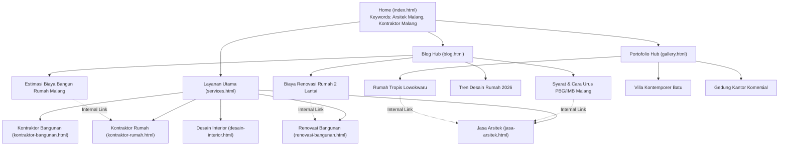
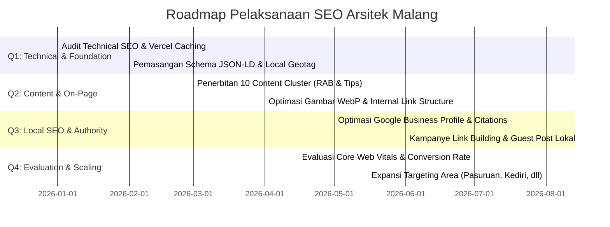

# 📈 Strategi SEO & Optimasi Organik (SEOStrategy.md)
**Website:** [https://arsitekmalang.web.id](https://arsitekmalang.web.id)  
**Niche & Industri:** Jasa Arsitektur, Kontraktor Bangunan, Renovasi Rumah, & Desain Interior  
**Target Area:** Malang Raya (Kota Malang, Kabupaten Malang, Kota Batu) & Jawa Timur  
**Versi Dokumen:** 1.0.0 (Diperbarui: 2026)

---

## 📋 Daftar Isi
1. [Ringkasan Eksekutif & Identitas Website](#1-ringkasan-eksekutif--identitas-website)
2. [Tujuan SEO & Target OKR](#2-tujuan-seo--target-okr)
3. [Riset Kata Kunci & Pemetaan Intent (Keyword Mapping)](#3-riset-kata-kunci--pemetaan-intent-keyword-mapping)
4. [Arsitektur Situs & Content Silo](#4-arsitektur-situs--content-silo)
5. [Standar SEO On-Page](#5-standar-seo-on-page)
6. [Technical SEO & Schema Structured Data](#6-technical-seo--schema-structured-data)
7. [Strategi Local SEO & Google Business Profile](#7-strategi-local-seo--google-business-profile)
8. [Strategi Konten & E-E-A-T (Google Search Quality)](#8-strategi-konten--e-e-a-t-google-search-quality)
9. [Strategi Link Building & Off-Page SEO](#9-strategi-link-building--off-page-seo)
10. [Metrik Keberhasilan (KPI) & Roadmap Pelaksanaan](#10-metrik-keberhasilan-kpi--roadmap-pelaksanaan)

---

## 1. 🏢 Ringkasan Eksekutif & Identitas Website

Website **Arsitek Malang** ([arsitekmalang.web.id](https://arsitekmalang.web.id)) diposisikan sebagai platform digital utama untuk bisnis layanan jasa arsitektur, perencanaan konstruksi, renovasi, dan desain interior di wilayah Malang Raya dan sekitarnya.

* **Nama Brand:** Arsitek Malang
* **Alamat Operasional:** Jl. Soekarno Hatta No. 45, Lowokwaru, Malang, Jawa Timur 65141
* **Kontak Utama:** +62 889-8964-3555
* **Target Audience:**
  * Pemilik tanah/rumah yang ingin membangun rumah hunian impian (tropis modern, minimalis, luxury).
  * Investor properti & pemilik lahan villa di area tempat wisata (Kota Batu, Karangploso).
  * Pemilik usaha komersial (kafe, ruko, kantor, restoran) yang membutuhkan desain & renovasi interior/eksterior.
  * Masayarakat yang membutuhkan pengurusan legalitas PBG/IMB di Pemerintah Kota/Kabupaten Malang.

---

## 2. 🎯 Tujuan SEO & Target OKR

### Target Kuantitatif (Dalam 6 - 12 Bulan):
1. **Top 3 Ranking Google Search** untuk keyword komersial utama di wilayah Malang:
   * `arsitek malang`
   * `jasa arsitek malang`
   * `kontraktor rumah malang`
   * `renovasi rumah malang`
   * `desain interior malang`
2. **Organik Traffic:** Meningkatkan lalu lintas pencarian organik hingga 10.000+ kunjungan/bulan.
3. **Konversi Lead (WhatsApp Click Rate):** Minimum 3-5% dari total visitor organik mengklik tombol konsultasi WhatsApp.
4. **Local Pack Top 3:** Tampil pada 3 Besar *Google Maps / Local Pack* untuk pencarian "arsitek terdekat" dan "kontraktor bangunan di Malang".

---

## 3. 🔍 Riset Kata Kunci & Pemetaan Intent (Keyword Mapping)

Strategi kata kunci dikelompokkan berdasarkan **User Intent** (Transactional, Commercial, Informational, Geotargeted):

### 3.1 Primary Commercial Keywords (High Conversion Intent)
| Keyword Target | Search Volume / Intent | Target URL Halaman |
| :--- | :--- | :--- |
| `arsitek malang` | High / Commercial | [index.html](file:///d:/Magang%20Industri/artsitekmalang/index.html) |
| `jasa arsitek malang` | High / Transactional | [jasa-arsitek.html](file:///d:/Magang%20Industri/artsitekmalang/jasa-arsitek.html) |
| `kontraktor rumah malang` | High / Transactional | [kontraktor-rumah.html](file:///d:/Magang%20Industri/artsitekmalang/kontraktor-rumah.html) |
| `kontraktor bangunan malang` | Medium / Transactional | [kontraktor-bangunan.html](file:///d:/Magang%20Industri/artsitekmalang/kontraktor-bangunan.html) |
| `renovasi rumah malang` | High / Transactional | [renovasi-bangunan.html](file:///d:/Magang%20Industri/artsitekmalang/renovasi-bangunan.html) |
| `desain interior malang` | High / Commercial | [desain-interior.html](file:///d:/Magang%20Industri/artsitekmalang/desain-interior.html) |

### 3.2 Long-Tail & Geo-Targeted Keywords
| Keyword Target | Intent | Target URL Halaman |
| :--- | :--- | :--- |
| `biaya renovasi rumah 2 lantai malang` | Commercial / Informational | [biaya-renovasi-rumah-2-lantai-malang.html](file:///d:/Magang%20Industri/artsitekmalang/biaya-renovasi-rumah-2-lantai-malang.html) |
| `estimasi biaya bangun rumah malang` | Commercial / Informational | [estimasi-biaya-bangun-rumah-malang.html](file:///d:/Magang%20Industri/artsitekmalang/estimasi-biaya-bangun-rumah-malang.html) |
| `jasa desain villa batu` | Geo-targeted Commercial | [jasa-desain-villa-kontemporer.html](file:///d:/Magang%20Industri/artsitekmalang/jasa-desain-villa-kontemporer.html) |
| `desain rumah tropis modern lowokwaru` | Geo-targeted Commercial | [rumah-tropis-modern-lowokwaru.html](file:///d:/Magang%20Industri/artsitekmalang/rumah-tropis-modern-lowokwaru.html) |

### 3.3 Informational Keywords (Educational / Content Marketing)
| Keyword Target | Intent | Target URL Halaman |
| :--- | :--- | :--- |
| `tahapan mengurus imb pbg malang` | Informational | [tahapan-mengurus-imb-pbg-malang.html](file:///d:/Magang%20Industri/artsitekmalang/tahapan-mengurus-imb-pbg-malang.html) |
| `tips renovasi rumah hemat` | Informational | [tips-renovasi-hemat.html](file:///d:/Magang%20Industri/artsitekmalang/tips-renovasi-hemat.html) |
| `tren desain rumah 2026` | Informational | [tren-desain-rumah-2026.html](file:///d:/Magang%20Industri/artsitekmalang/tren-desain-rumah-2026.html) |
| `cara memilih arsitek terbaik di malang` | Informational | [panduan-memilih-arsitek-malang.html](file:///d:/Magang%20Industri/artsitekmalang/panduan-memilih-arsitek-malang.html) |

---

## 4. 🏛️ Arsitektur Situs & Content Silo

Arsitektur situs menggunakan struktur **Siloing/Topic Clustering** untuk menyalurkan *Link Equity* secara efisien dari halaman blog dan portofolio menuju ke halaman penawaran jasa (Money Pages).



---

## 5. 🏷️ Standar SEO On-Page

Setiap halaman web di `arsitekmalang.web.id` wajib memenuhi standar SEO On-Page berikut:

### 5.1 Tag Judul (Title Tag) & Meta Description
* **Panjang Title Tag:** 50 - 60 Karakter.
* **Panjang Meta Description:** 140 - 160 Karakter dengan menyertakan Nomor Call-to-Action / Telepon.
* **Format Title Tag Utama:**  
  `[Nama Layanan / Keyword Utama] - [Brand / Keunggulan] | Arsitek Malang`

### 5.2 Hirarki Heading (H1, H2, H3)
* **H1:** Hanya boleh **1 per halaman** dan wajib mengandung Keyword Utama Halaman.
* **H2:** Untuk membagi sub-topik layanan, fitur, alur kerja, portofolio terkait, dan FAQ.
* **H3:** Digunakan untuk daftar detail layanan, poin-poin FAQ, atau spesifikasi teknik.

### 5.3 Optimasi Gambar & Alt Text
* Format gambar disarankan menggunakan **WebP** atau **AVIF** untuk kecepatan beban maksimal.
* Nama file gambar harus deskriptif (contoh: `desain-rumah-minimalis-malang.webp` bukannya `IMG001.webp`).
* Tag `alt` wajib diisi menggunakan konteks gambar dan geo-keyword yang relevan (contoh: `alt="Desain Rumah Minimalis Modern 2 Lantai di Lowokwaru Malang"`).

### 5.4 Internal Linking Rules
* Setiap artikel blog **wajib** memiliki minimal 2-3 tautan internal (*contextual anchor text*) menuju halaman layanan terkait.
* Setiap studi kasus galeri **wajib** menautkan kembali ke jenis layanan yang digunakan.
* Menggunakan kata kunci deskriptif sebagai anchor text (hindari anchor text generik seperti "klik di sini").

---

## 6. ⚙️ Technical SEO & Schema Structured Data

### 6.1 Server & Platform Optimizations
* **Hosting:** Vercel CDN Global.
* **Konfigurasi Cache Header (`vercel.json`):** Asset statis (CSS, JS, WebP) di-cache dengan directive `Cache-Control: public, max-age=31536000, immutable`.
* **Pengalihan SSL & HTTPS:** Paksa koneksi aman melalui HTTPS.

### 6.2 XML Sitemap & Robots.txt
* **Robots.txt Location:** [robots.txt](file:///d:/Magang%20Industri/artsitekmalang/robots.txt)
* **Sitemap Location:** [sitemap.xml](file:///d:/Magang%20Industri/artsitekmalang/sitemap.xml)
* **Aturan:** Seluruh halaman berdiri sendiri (*standalone pages*) didaftarkan pada `sitemap.xml` dengan atribut `<lastmod>`, `<changefreq>`, dan `<priority>` yang valid.

### 6.3 Structured Data (JSON-LD Schema Markup)
Seluruh halaman harus dilengkapi data terstruktur JSON-LD standar Schema.org:

1. **`LocalBusiness` & `GeneralContractor` (di Halaman Utama):**
   ```json
   {
     "@context": "https://schema.org",
     "@type": ["LocalBusiness", "GeneralContractor", "HomeAndConstructionBusiness"],
     "name": "Arsitek Malang",
     "url": "https://arsitekmalang.web.id",
     "telephone": "+6288989643555",
     "address": {
       "@type": "PostalAddress",
       "streetAddress": "Jl. Soekarno Hatta No. 45, Lowokwaru",
       "addressLocality": "Malang",
       "addressRegion": "Jawa Timur",
       "postalCode": "65141",
       "addressCountry": "ID"
     },
     "geo": {
       "@type": "GeoCoordinates",
       "latitude": -7.9467,
       "longitude": 112.6159
     }
   }
   ```
2. **`Service` Schema:** Digunakan pada halaman detail jasa (`jasa-arsitek.html`, `kontraktor-rumah.html`).
3. **`Article` / `BlogPosting` Schema:** Digunakan pada semua halaman artikel blog.
4. **`FAQPage` Schema:** Digunakan pada halaman beranda dan layanan yang menyajikan komponen Accordion FAQ.
5. **`BreadcrumbList` Schema:** Membantu Google menampilkan *rich snippet breadcrumb* pada hasil pencarian.

---

## 7. 📍 Strategi Local SEO & Google Business Profile

Karena bisnis bersifat lokal (Malang Raya), strategi Local SEO menjadi salah satu pilar pendapatan utama:

1. **Google Business Profile (GBP) Optimization:**
   * Menyelaraskan informasi **NAP (Name, Address, Phone)** 100% konsisten antara Website dan profil Google Maps.
   * Kategori Utama: *Architect, General Contractor, Interior Designer*.
   * Mengunggah foto proyek asli berkala (minimal 3 foto baru per minggu).
2. **Konsistensi Meta Geotagging:**
   * Penggunaan meta tag `geo.region`, `geo.placename`, `geo.position`, dan `ICBM` di `<head>` situs.
3. **Pengumpulan Ulasan / Reviews Strategy:**
   * Melakukan otomatisasi permintaan ulasan bintang 5 kepada klien setelah serah terima kunci / penyelesaian desain.
   * Membalas setiap ulasan yang masuk dengan menyertakan kata kunci lokal (contoh: *"Terima kasih telah mempercayakan renovasi rumah di Blimbing Malang kepada tim Arsitek Malang"*).

---

## 8. ✍️ Strategi Konten & E-E-A-T

Google menerapkan kriteria ketat **E-E-A-T (Experience, Expertise, Authoritativeness, Trustworthiness)** untuk bisnis di bidang properti dan konstruksi.

### Implementasi pada Content Lifecycle:
1. **Experience (Pengalaman Nyata):**
   * Menampilkan foto & video *progress* proyek aktual di lapangan (bukan gambar stok internet standar).
   * Melampirkan studi kasus rincian denah, tantangan kontur tanah di Malang/Batu, dan solusi struktural yang diterapkan.
2. **Expertise (Keahlian Teknis):**
   * Menyajikan panduan perhitungan Rencana Anggaran Biaya (RAB) yang realistis sesuai standar harga bahan bangunan terkini di Malang.
   * Menulis artikel panduan regulasi legalitas bangunan lokal (PBG & SLF di Malang).
3. **Authoritativeness (Otoritas):**
   * Profil tim arsitek bersertifikat IAI (Ikatan Arsitek Indonesia) & tenaga ahli konstruksi.
4. **Trustworthiness (Kepercayaan):**
   * Transparansi alur kerja, garansi pemeliharaan struktur bangunan, dan testimoni klien nyata.

---

## 9. 🔗 Strategi Link Building & Off-Page SEO

Daya saing domain (*Domain Authority*) ditingkatkan melalui perolehan backlink berkualitas dan relevan:

1. **Local Citation & Directory Submission:**
   * Mendaftarkan bisnis di direktori bisnis Indonesia (YellowPages, IndoNetwork, Kompasiana, Google Maps, dll.).
2. **Guest Blogging & Content Partnerships:**
   * Menulis artikel tamu di blog properti, gaya hidup, atau portal berita lokal Jawa Timur (Malang Post, Radar Malang, dll.).
3. **Portfolio Showcase Platforms:**
   * Memublikasikan portofolio desain di platform arsitektur ternama (Archify, Arsitag, Behance, Pinterest) dengan menyertakan tautan kembali ke `arsitekmalang.web.id`.

---

## 10. 📊 Metrik Keberhasilan (KPI) & Roadmap Pelaksanaan

### 10.1 Key Performance Indicators (KPI)
* **Google Search Console:** Total Clicks, Organic Impressions, Average CTR, Average Position.
* **Google Analytics 4 (GA4):** Engagement Rate, Duration per Session, WhatsApp Button Conversion Rate.
* **Core Web Vitals Metric:**
  * **LCP (Largest Contentful Paint):** < 2.5 detik.
  * **FID / INP (Interaction to Next Paint):** < 200 ms.
  * **CLS (Cumulative Layout Shift):** < 0.1.

### 10.2 Roadmap Pelaksanaan SEO (Roadmap 4 Triwulan)



---
*Dokumen strategi SEO ini dirancang untuk menjadi panduan kerja berkelanjutan bagi tim pengembang web, content writer, dan marketing digital **Arsitek Malang**.*
